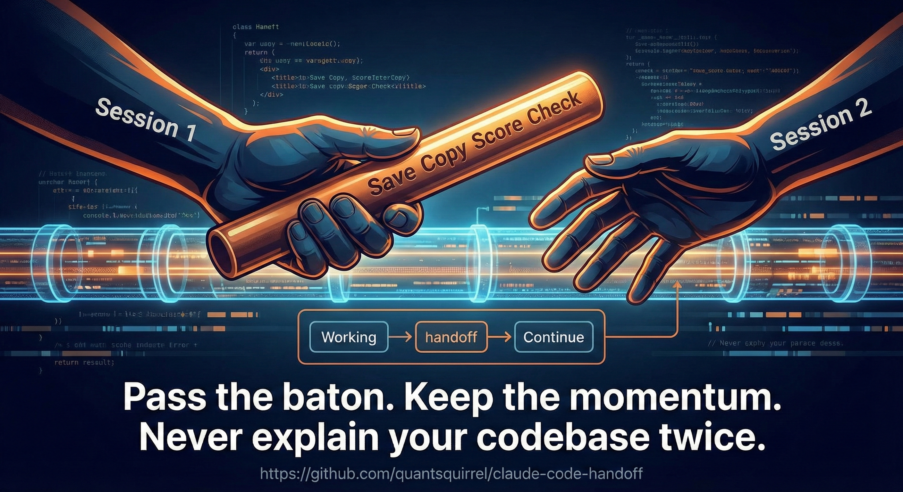

<div id="top"></div>

<div align="center">



**바톤을 넘기세요. 모멘텀을 유지하세요. 코드베이스를 두 번 설명하지 마세요.**

**[English](README.md)** | **한국어**

[](LICENSE)
[](https://github.com/anthropics/claude-code)
[](https://github.com/quantsquirrel/claude-handoff)
[](https://github.com/quantsquirrel/claude-handoff)

</div>

---

## 빠른 시작

```bash
# 1. 설치
/plugin install quantsquirrel/claude-handoff

# 2. 사용
/handoff
```

**끝.** 다음 세션을 위해 컨텍스트가 보존됩니다.

---

## 목차

- [빠른 시작](#빠른-시작)
- [Handoff란?](#handoff란)
- [주요 특징](#주요-특징)
- [설치](#설치)
- [사용법](#사용법)
- [실행 결과](#실행-결과)
- [자동 핸드오프 훅](#자동-핸드오프-훅)
- [Compact 복구](#compact-복구)
- [설정](#설정)
- [문제 해결](#문제-해결)
- [기여하기](#기여하기)

---

## Handoff란?

| Handoff 없이 | Handoff 사용 시 |
|--------------|-----------------|
| ❌ 매 세션마다 컨텍스트 재설명 | ✅ 자동 컨텍스트 캡처 |
| ❌ 실패한 접근법 반복 | ✅ 실패한 접근법 추적 |
| ❌ 결정사항 및 진행상황 손실 | ✅ 결정사항 문서화 |
| ❌ 수동 노트 작성 | ✅ 한 줄 명령으로 생성 |
| ❌ 불완전한 인수인계 | ✅ 품질 점수 검증 |

**한 번의 명령. 완전한 컨텍스트. 재설명 제로.**

---

## 주요 특징

| 기능 | 설명 |
|------|------|
| 🎯 **포괄적 컨텍스트** | 프로젝트 상태, 결정사항, 진행상황 자동 기록 |
| 📋 **클립보드 자동 복사** | 한 줄의 명령으로 압축된 프롬프트가 클립보드에 복사 |
| 🔗 **Git 통합** | 커밋 히스토리, 브랜치, 스테이지된 변경사항 포함 |
| 🚫 **실패한 접근법** | 작동하지 않은 것을 문서화하여 반복 방지 |
| ⛓️ **Handoff 체인** | 이전/다음 세션을 연결하여 연속성 유지 |
| 🔐 **시크릿 검출** | API 키, 자격증명 등 잠재적 보안 위험 경고 |
| ⭐ **품질 점수** | Handoff 완성도를 0-100 점수로 검증 |
| 🇰🇷 **한국어 지원** | 한국어 라벨과 컨텍스트를 포함한 클립보드 프롬프트 |
| ✅ **TODO 통합** | .claude/tasks.json의 작업 자동 포함 |
| 🔔 **자동 핸드오프 훅** | 컨텍스트 70% 도달 시 `/handoff` 권유 (선택) |

---

## 설치

### 옵션 1: 단일 파일 (권장)

```bash
curl -o ~/.claude/commands/handoff.md \
  https://raw.githubusercontent.com/quantsquirrel/claude-handoff/main/SKILL.md
```

**끝.** 이제 `/handoff`를 사용할 수 있습니다.

### 옵션 2: 전체 플러그인 (고급)

컨텍스트 70% 도달 시 자동 알림을 원하면:

```bash
/plugin marketplace add quantsquirrel/claude-handoff
/plugin install handoff@quantsquirrel
```

포함 기능:
- 70% 컨텍스트 도달 시 자동 알림
- 작업 크기 추정
- `/handoff` CLI 자동완성

---

## 업데이트

### Marketplace 사용자

```bash
/plugin update handoff
```

### Git Clone 사용자

```bash
cd ~/.claude/skills/handoff && git pull
```

### 수동 설치 사용자

빠른 시작의 curl 명령어를 다시 실행하여 최신 버전을 다운로드하세요.

---

## 사용법

### 워크플로우

```
1. /handoff          → 컨텍스트가 클립보드에 저장됨
2. /clear            → 새 세션 시작
3. Cmd+V (붙여넣기)  → 전체 컨텍스트로 재개
```

### 명령어

```bash
/handoff fast [주제]        # 빠른 체크포인트 (~200 토큰)
/handoff slow [주제]        # 전체 핸드오프 (~500 토큰)
/handoff [주제]             # slow의 별칭
```

<sub>예시: `/handoff fast "auth 구현"` · `/handoff slow "JWT migration"`</sub>

| 상황 | 명령어 |
|------|--------|
| 컨텍스트 70%+ 도달 | `/handoff fast` |
| 짧은 휴식 (< 1시간) | `/handoff fast` |
| 세션 종료 | `/handoff slow` |
| 긴 휴식 (2시간+) | `/handoff slow` |

---

## 계층적 요약 (v2.1)

요약 상세도를 선택하세요:

| 레벨 | 토큰 | 내용 |
|------|------|------|
| L1 | ~100 | 현재 작업 + 다음 단계 |
| L2 | ~300 | L1 + 결정사항 + 실패한 접근법 |
| L3 | ~500 | 전체 컨텍스트 (slow와 동일) |

사용법:
```bash
/handoff l1 "주제"    # 빠른 스냅샷
/handoff l2 "주제"    # 균형잡힌 (기본값)
/handoff l3 "주제"    # 전체 상세
```

---

## 실행 결과

`/handoff` 실행 후:

✅ **문서 생성됨** - `.claude/handoffs/handoff-YYYYMMDD-HHMMSS.md`
📋 **클립보드에 복사됨** - 압축된 프롬프트 붙여넣기 준비 완료
📊 **품질 점수 표시** - 0-100 점수 (목표: 70+)
🔐 **보안 검사** - 시크릿 감지 시 경고 표시

### 세션 재개 방법 (중요!)

핸드오프 생성 후, **새 세션**에서 다음 단계를 따르세요:

```bash
# Step 1: 현재 세션 초기화
/clear

# Step 2: 핸드오프 프롬프트 붙여넣기 (Cmd+V 또는 Ctrl+V)
# 압축된 컨텍스트가 이미 클립보드에 있습니다!
```

> ⚠️ **왜 `/clear`를 먼저?** 초기화 없이 붙여넣으면 컨텍스트가 잘리거나 기존 대화와 섞일 수 있습니다. 항상 새로 시작하세요!

---

## 구조화된 출력 형식 (v2.1)

Handoff는 이제 자연어와 함께 JSON 구조화된 메타데이터를 지원합니다:

- `files_modified`: 정확한 경로와 줄 번호
- `functions_touched`: 함수 이름과 작업
- `failed_approaches`: 작동하지 않은 방법과 이유
- `decisions`: 근거와 함께 내린 선택

이 구조화된 형식은 LLM의 더 나은 파싱과 외부 도구와의 통합을 가능하게 합니다.

---

## 자동 핸드오프 훅

컨텍스트 사용량을 모니터링하고 70%에 도달하면 핸드오프 생성을 권유합니다.

```bash
# 설치
cd ~/.claude/skills/handoff
bash hooks/install.sh
```

| 사용량 | 동작 |
|--------|------|
| 70-79% | 📋 제안 표시 |
| 80-89% | ⚠️ 경고 - 권장 |
| 90%+ | 🚨 긴급 - 즉시 생성 |

---

## Compact 복구

핸드오프 생성 중 컨텍스트가 압축되면 복구 메커니즘이 작업을 보존합니다.

### 자동 초안 (Auto-Draft)

70% 사용량 도달 시 자동으로 초안 저장:

| 항목 | 설명 |
|------|------|
| 위치 | `.claude/handoffs/.draft-{timestamp}.json` |
| 내용 | 세션 ID, 토큰 수, git 브랜치, 작업 디렉토리 |
| 정리 | 동일 세션의 이전 초안 자동 교체 |

### 복구 스크립트

복구 가능한 데이터 확인:

```bash
node ~/.claude/skills/handoff/hooks/recover.mjs
```

**출력:**
- 타임스탬프별 초안 파일 목록
- 중단된 생성 작업 (lock 파일)
- 복구 방법 안내

### Lock 파일

핸드오프 생성 중:
- Lock 파일 생성: `.claude/handoffs/.generating.lock`
- 내용: 세션 ID, 주제, 시작 시간
- 완료 시 자동 삭제
- 중단 시 복구 스크립트에서 감지

<div align="right"><a href="#top">⬆️ 맨 위로</a></div>

---

## 보안

민감한 데이터는 자동으로 감지되어 삭제됩니다:

```
API_KEY=sk-1234...  → API_KEY=***REDACTED***
PASSWORD=secret     → PASSWORD=***REDACTED***
Authorization: Bearer eyJ...  → Authorization: Bearer ***REDACTED***
```

**감지 항목:**
- API 키 및 시크릿
- JWT 토큰 및 Base64 인코딩된 자격증명
- Authorization 헤더의 Bearer 토큰
- 민감한 패턴을 가진 환경 변수

**GDPR 고려사항:** 핸드오프 문서에는 개인 데이터가 포함될 수 있습니다. 제3자와 공유하기 전에 핸드오프를 검토하고 오래된 핸드오프는 정기적으로 삭제하세요.

---

## 문제 해결

### 클립보드에 복사되지 않음

```bash
# macOS 확인
which pbcopy

# Linux 확인 및 설치
which xclip || sudo apt-get install xclip
```

### 품질 점수가 낮음

- ✓ Git 저장소 초기화: `git init`
- ✓ 실패한 접근법 문서화
- ✓ 모든 필수 섹션 작성

---

## 기여하기

한국어 관련 이슈나 기여를 환영합니다!

### 개발 설정

```bash
git clone https://github.com/quantsquirrel/claude-handoff.git
cd handoff
npm install
npm run dev
```

### 이슈 제출

[GitHub Issues에서 제출하기](https://github.com/quantsquirrel/claude-handoff/issues)

---

## 라이선스

**MIT License**

Copyright © 2026 Handoff Contributors

자세한 내용은 [LICENSE](LICENSE) 파일을 참조하세요.

---

## 지원

**리소스**
- 문서: [docs](./docs) 디렉토리 확인
- 예시: [examples](./examples) 디렉토리 참조

**커뮤니티**
- 이슈: [GitHub Issues](https://github.com/quantsquirrel/claude-handoff/issues)
- 토론: [GitHub Discussions](https://github.com/quantsquirrel/claude-handoff/discussions)

---

**🏃 바톤을 전달할 준비가 되셨나요?** `/handoff`를 실행하고 모멘텀을 유지하세요!

Made by [QuantSquirrel](https://github.com/quantsquirrel) | [이슈 제출](https://github.com/quantsquirrel/claude-handoff/issues)

⭐ **GitHub에서 스타를 눌러주세요:** [claude-handoff](https://github.com/quantsquirrel/claude-handoff)

<div align="right"><a href="#top">⬆️ 맨 위로</a></div>
